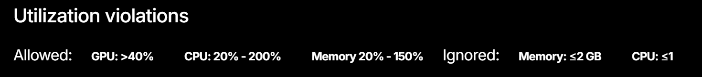

# Nautilus Kubernetes Deployment Tutorial 
#### By: Caleb
*Last updated 8/26/25*

Nautilus is an organization that offers free computing resources to research groups.

For general and high level access to computing resources, [Coder](https://nationalresearchplatform.org/documentation/userdocs/coder/coder/)  can be used. Coder offers premade templates and easy access to FPGAs. However, Kubernetes allows a much finer control over everything including individual storage control, ability to request specific amounts of resources, and persistent storage even after shutting down a server. Coder can also be used with Kubernetes, combining the best of both (tutorial [here](https://nationalresearchplatform.org/documentation/userdocs/coder/deploy/)). Familiarity with Kubernetes is strongly recommended.

If a full operating system is neccesary, ask the Nautilus admins about Virtual Machines. They are much slower than Deployments

**A warning**, do not try to set up the following in WSL; there are many issues with it. For Windows, running everything in Powershell works perfectly fine.

If you encounter any issues, contact me at ceravcal@uw.edu or the NRP admins at [Element](https://element.nrp-nautilus.io/#/room/#general:matrix.nrp-nautilus.io).

Before getting started read [these](https://nationalresearchplatform.org/documentation/userdocs/start/policies/) policies.


## **Downloading Server Controller**

This section covers setting up Kubectl on your computer. Kubectl is the way to setup and control server elements from your personal computer. A full tutorial is [here](https://nationalresearchplatform.org/documentation/userdocs/start/getting-started/#cluster-access-via-kubectl), however I will give a brief overview.

1. Download kubectl from the [Kubernetes release page](https://kubernetes.io/releases/download/#binaries)

2. Download this [config file](https://nationalresearchplatform.org/config),
and put it into your $HOME/.kube folder. 
If .kube doesn't exist, make it with mkdir ~/.kube

1. Now install [Kubelogin](https://github.com/int128/kubelogin?tab=readme-ov-file#setup)
(Your oidc-issuer-url is https://authentik.nrp-nautilus.io/application/o/k8s/).
    Your oidc-client-id should already be set up (I believe I found it in kubectl config view --raw if you can't find it)

1. Now run:
    ````
    kubectl get pods -n <YOUR NAMESPACE>
    (namespace is uw-acme if you are in Scott's UW lab)
    ````
    It should now open a webpage to authentiate
2. Finally, run: 
   
    ```
    kubectl config set contexts.nautilus.namespace <YOUR NAMESPACE>
    ```

## **Setting Up the Server**

Now that you have kubectl set up, you can make a server. First setup an access password for yourself using:
```
kubectl create secret generic my-pass --from-literal=my-pass=YOUR_PASSWORD
```
**Make sure to replace YOUR_PASSWORD with a password**. Write down the password somewhere.

Now download deployment.yaml and ingress.yaml (they are in the same folder as this tutorial).


### **Server Storage**
If you are joining an already started server group, ignore the text below and just create the private volume. Ask your server manager for the name of the shared volume if it exists.

For server storage, there are multiple options. The fastest is to set everything up using single user access storage. In this case just download homevol.yaml.
**If you want to set up a shared file system**, also download sharedvol.yaml and uncomment the code near the bottom in deployment.yaml. In the sectiont that says mounts you can configure where each gets connected to in the server. 
Currently it is set up for the /home/user directory to be mounted to individual storage with an additional directory /home/user/shared to be connected to the shared storage if you uncomment the code
The shared filesystem is in general slower to upload to while the individual one is faster


**Before creating each resource, run *kubectl get (resource)* to make sure you aren't overwriting an existing one.** For example, run *kubectl get pvc* and look at the returned names to see if your pvc has the same name
1. First, edit the name section to something unique in each of the volume yaml files you are using
   
2. Run: 
```
kubectl apply -f homevol.yaml
```
If using the shared filesystem, also run: 
```
kubectl apply -f sharedvol.yaml
```

1. Change the commented lines in deployment.yaml and ingress.yaml. For the host name in ingress.yaml, I recommend hls4ml-desktop-\<YOUR NAME\>.nrp-nautilus.io
   
2. Then run: 
```
kubectl apply -f deployment.yaml
kubectl apply -f ingress.yaml
```

1. Now run:
```
kubectl get pods
```
 Once the pod you just created (look at the *age* section for the youngest pod) says 1/1 under Ready, then it was succesful. It can take some time to work; keep running kubectl get pods periodically to check on progress.

**NOTE:** A handy debugging tool is kubectl describe (resource) (which resource). This command works for resources of deployments, pods, and replicasets which, if things aren't working, are all useful to check in on. For example, if your deployment is named egl (viewable in kubectl get deployments), *kubect describe deployment egl* will give you information about your active deployment. If you see taint errors in your pod description, give it time. The taints are pods that it can't connect to because they are currently down.

Once everything is successful, paste the hostname you put in ingress.yaml into your web browser. Hit connect, and type in the password you set up earlier.

You should now be connected and able to use the server!

For each additional person, create a new private volume (with a different name), create a modified deployment.yaml with this volume as the private one (modify everything done before), and run everything else the same. If you don't change the name of the deployment and the name of the server, it will modify any active deployments in your namespace instead of creating new ones.

If you modify your deployment .yaml file, you can update your deployment using 
```
kubectl apply -f deployment.yaml
```
## **Server Upkeep and Resources**

Nautilus alots a certain amount of each resource to each lab. On top of this, your pod will be flagged for resource usage violations if it doesn't stay within the following

Therefore, idling pods are almost always flagged. 

Because of this, when you aren't using the pods, please shut them down using
```
kubectl scale deployment <DEPLOYMENT_NAME> --replicas=0
```
\<DEPLOYMENT NAME\> is the deployment used to create the pod and is the start of the pods' name. 

Starting the pod again is done by doing 
```
kubectl scale deployment <DEPLOYMENT_NAME> --replicas=1
```
NEVER DIRECTLY DELETE A POD. Just scale the deployment that controls it. 


Nautilus shuts off any deployments once they are up for 2 weeks straight to free up resources. To reset this time frame, you can manually delete your deployments and recreate them
Use:
```
kubectl delete -f deployment.yaml
kubectl delete -f ingress.yaml
```
to shut down the deployment. DO NOT DELETE YOUR VOLUMES! (Unless you want to delete all of your data).

Starting the server back up is done simply by rerunning:
```
kubectl apply -f deployment.yaml
kubectl apply -f ingress.yaml
```
