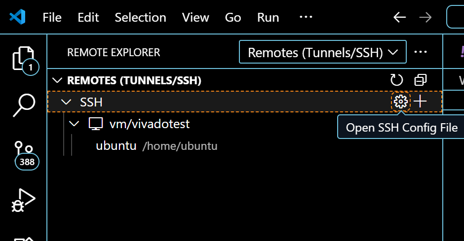
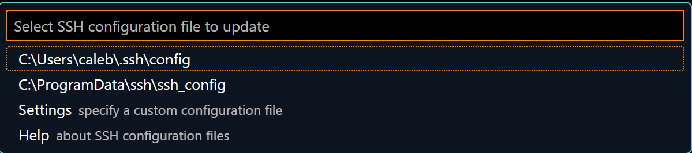
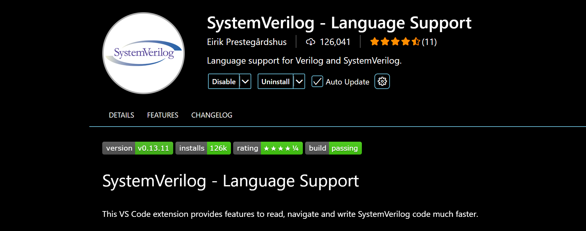

# Virtual Machines
### Intro
Virtual machines are a complete image of an OS. However they tend to run slower and in general are more complicated to set up. Due to the slow speed of the remote connection to a Virtual Machine, I show how to connect the server via SSH to VS code for a much smoother experience. I still use a limited GUI, though I don't spend much time increasing the speed of the graphics. Virtual machines tend to have more issues setting up than a deployment so use deployments if it works well for your use case.

**Note:** Any pertinent information not discussed here can be found in [KubeVirt's documentation](https://kubevirt.io/user-guide/user_workloads/accessing_virtual_machines/)

## Downloading Tools

If you haven't gotten the kubectl tools setup yet, do so by working through the Nautilus Tutorial. The first step for virtual machines is installing Kubevirt, the manager for virtual machines. Some tutorials setup kubevirt with kubectl, however I install it as a standalone since Nautilus uses a slightly older version
run:
Invoke-WebRequest -Uri https://github.com/kubevirt/kubevirt/releases/download/v1.5.0/virtctl-v1.5.0-windows-amd64.exe -OutFile virtctl.exe
(Works on windows. If you go to the link you can download it directly if needed)

Place the executable in a folder that is on your computer's path so you can execute it. If you don't know your computer's path, run `$env:Path` on windows to find folders to place it into, or search *adding folders to Windows path* on the internet to add a new folder. I like the second option 

To verify that virtctl is working, run `virtctl --help` 


## Starting a VM
Now that you have virtctl installed, we will setup a Virtual Machine. An example Virtual Machine yaml is shown in virtualmachine.yaml. This is set up to create a volume with an ubuntu image, for more information about volumes, read the `Server Storage` Section of the Deployments tutorial. 
Download the virtualmachine.yaml file and change what is neccesary, make sure to change the marked fields. The storageclass is configured so you can increase storage space later, so don't worry about running out of space.

Accessing the virtual machines requires creating a secret from your ssh key folder. If you do not have ssh keys currently, use the windows command `ssh-keygen` to create them. To create the secret, use `kubectl create secret generic my-pub-key --from-file=key1=SSHKEYFILE.pub` Make sure the keyfile used is your public one (ending in .pub). If you need to add more keys later, use `kubectl edit secret my-pub-key` and add a new key field with the new ssh key. The way the Virtual Machine is configured, the server should automatically see the new ssh keys in the secret. 

**Note:** If you add more users to the Virtual Machine with `sudo adduser newuser` make sure to add the user to the qemuGuestAgent.users section of the yaml and then `kubectl apply -f` the file to update the VM

Once you have the yaml configured, use `kubectl apply -f virtualmachine.yaml` to create the Virtual Machine. 

Here are a couple useful commands you'll need
```
virtctl start <VM name>   # Starts the VM
virtctl stop <VM name>    # Stops the VM
virtctl console <VM name> # Patches you into the VM console
virtctl vnc <VM name>     # Opens a vnc connection to the VM
```
For most of the setup, use `virtctl console` to give commands to the vm as it is much faster than `virtctl vnc`. If you just want to run the server in headless mode (No GUI), this is all you need. However, I recommend downloading xfce for a graphical interface so you can download vivado and other such tools. Use `sudo apt install xfce4` to do so and use `startxfce4` in the vnc connection to start the graphics interface. 

## Setting up Connection to VS Code
First thing we need to do is verify the SSH connection. Try running `virtctl ssh <VM name>` to see if you can connect. If you are able to, great! If not, enter the console with `virtctl console <VM name>` and run the following commands
```
sudo dhclient enp1s0
systemctl status ssh
```
If the first command passes with no output and the second command shows all green status, then you should be ok. The first command was to set up the ethernet connection and the second one was to verify the ssh connection in the VM

Once you can connect to SSH, now it is time to connect it to VS code. Download the VS code Remote Explorer extention by Microsoft. Once installed, you should see a computer icon with 2 arrows facing eachother on your left toolbar. Click this


Once it is open, hover your mouse over the SSH bar and click the settings icon that says *Open SSH Config File*



I don't believe the config you use matters, however I use my personal config file.

Once inside, paste the following 

```
Host vmi/*
  ProxyCommand virtctl port-forward --stdio=true %h %p
Host vm/*
  ProxyCommand virtctl port-forward --stdio=true %h %p
```
Make sure to save


What this does is sets up your ssh to use virtctl when connecting to a vm.

After doing this, run `ssh <USER NAME@vm/<VM name>>` to verify the ssh connectivity

If this works, it is now time to set up the Remote Explorer. Go back to VS code and press the + icon on the ssh bar (next to the settings icon from previous)

It will ask you for the ssh command, type in `ssh <USER NAME@vm/<VM name>>` and update the config file you used earlier

Once it is configured, you can now enter it by pressing either of the *Connect in Current/New Window* buttons

You should now be all set to use it! The remote connection uses the vscode extentions downloaded locally on the VM if you are confused
### Vivado License

To use Nautilus' Xilinx license server, add 
`export XILINXD_LICENSE_FILE="2100@xilinxd.xilinx-dev"`
to the end of your ~/.bashrc file. Vivado reads this variable looking for a license. 
## Using Virtual Machines for Vivado

For using HLS4ML by itself, the steps previously should be sufficient as jupyter works fine in VS code. However, using Vivado uses a bit more messing around. Since you can't use the GUI (without dealing with massive lag), you'll have to use tcl scripts to tell vivado what to do. An example script is shown (Script.tcl). Simply place the script in the same directory as your project and run `vivado -mode batch -source Script.tcl` Make sure you are cd'ed into your project directory. Once vivado stops running, you can either read the reports locally or download the .dcp file back to your personal computer and open the file on your local Vivado. Do so using the `Open Checkpoint` option. Make sure it's the same version of Vivado used to generate the file

I recommend downloading one of the vs code SystemVerilog extensions for automatic code highlighting and error checking. I like the one by Eirik Prestegårdshus. 


### Troubleshooting

If the shell can't find vivado, make sure vivado is in your vm's system path (Check with `echo $PATH`). If it isn't, run `printf '\nexport PATH=$PATH:/path/to/vivado/bin\n'>>~/.bashrc` to automatically add it to the end of your bashrc. If bashrc doesn't exist, just replace `>>` with `>`. Either relaunch your shell or run `source ~/.bashrc`. Afterwards, run `echo $PATH` to make sure vivado's bin folder is now there.
