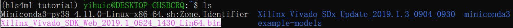

# HLS4ML Environment Set Up Tutorial
## _The toturial will be seperated into 4 parts_

First of all, welcome to this team. 
This tutorial will guide you on setting up the environment you need to run HLS4ML on your own computer.

 _✨Whish your setup journey goes  well and smooth ✨_

## System requirment
We recommend using Linux as the OS, so if you are using Linux or have Linux virtual machine on your computer, you may continue from step 2. If you are using Windows as your OS, we highly recommend using a feature called Windows Subsystem for Linux, aka WSL to run Linux. You may also build a virtual machine by yourself, but this tutorial will only teach you how to use WSL. (We currently don’t know how to build environment on MacOS, if you are using MacOS, please contact Professor or Elham for help)

## Step 1: Setup the WSL(Windows Subsystem for Linux) for Window machine

In the taskbar, click the tool and type in “Turn Windows Feature On or Off”,


you may also find it from  Control Panel -> Programs -> Turn Windows features on or off


Then select the Windows Subsystem for Linux and click OK.


You may have some error code, generally it is due to old version of your current windows, update your windows should fix the problem. 


Now you have enabled the feature, it is time to get a Linux for you. We recommend using Linux 18.04 LTS (Long term support version) as your Linux version. There are two ways to do so. You may download it from Microsoft Store, just search Linux 18.04 LTS. 

If you don’t want to install it in your C disk, you may download it from this [link] (https://drive.google.com/file/d/1yBP0fodQXuzFd9DRWxg6J7Xh2v59tvY6/view?usp=sharing)

For people who want download it to the place you want (which means you may install this on a flash drive or a portable hard drive), once you have the zip file, unzip it to a folder and you will see:

Then click the ubuntu1804.exe or open it from Microsoft Store or Quick Start Menu if you downloaded it from there. A terminal will pop up and Linux will start its initial set up, it will take a few minutes. Then it will ask you to set a username and password as its administrator

Please set your username with a lowercase alphabet start and no space between each word. Then type in:

```
sudo apt update 
sudo apt upgrade
```
This is for upgrading your Linux. (sudo means super user do, Linux will ask your password to processed the process, and when you type in your password, it will not appear on the terminal, don’t worry, it is designed to do so, just type in your password and press ENTER) After this step, your Linux OS is all set.

## Step 2: Steup Miniconda and hls4ml into your Linux system

As an engineer, you may be doing multiple projects at the same time, each project will use different environment and packages as its requirement. How to keep one’s environment and packages just to its own? It is time to introduce “Conda”, a powerful package manager and virtual environment builder.

In your windows browser, access [Conda.io] (https://docs.conda.io/en/latest/miniconda.html#installing)

Under Linux installers, 
right click Python3.9 version and copy the link address


Then in your Linux terminal, type wget, then paste the link to terminal (In terminal, right click is paste), so the entire command should looks like:

```
wget https://repo.anaconda.com/miniconda/Miniconda3-py39_4.11.0-Linux-x86_64.sh
```

This command will help you download Miniconda3 installation program to your Linux. Once it is finished downloading, type the following code:

```
bash Miniconda3-py39_4.11.0-Linux-x86_64.sh
```

Or you can just type
```
bash Mini
```
then press Tab, it will auto fill the rest of the command. Then follow the guidance and finish installation. Once you finished installation, terminal will ask to whether to initialize conda or not, type yes and press ENTER.

Now we need to edit one file to make sure your Linux recognizes the conda you just installed. You will use VIM, a powerful text editor, to edit bash_profile.

Here are some commands you need to know for later operation:

```
vim <Filename>   ---to open the file we want
:wq              ---save edited file
:q!              ---quit the file without saving
i                ---change the current mode into insert mode
```

Once you enter the vim, you need to press ESC before entering the command

Please follow the steps to make the modification for your terminal:

- Type
 
```
vim ~/.bash_profile
```

- Press ENTER.
 
- Press i to change the vim into insert mode.
- Copy and paste the following things into the terminal. Change the <YOUR USERNAME > part into your username that you set in the step 1.

```
if [ -f ~/.bashrc ]; then . ~/.bashrc; fi

export PATH="/home/<YOUR USERNAME>/miniconda3/bin:$PATH"

alias jupyter-notebook="/home/<YOUR USERNAME>/miniconda3/envs/hls4ml-tutorial/bin/jupyter-notebook --no-browser"
```

- Press ESC and type 
```
:wq
```

- Once you exit vim, run the following code in your terminal:

```
 source ~/.bash_profile
 source ~/.bashrc
```

After making the configuration, it is time to download hls4ml into your Linux,
run the following command:
```
git clone https://github.com/fastmachinelearning/hls4ml-tutorial.git
```

When it is finished, you need to change directory into the folder you just downloaded, here are some commands for Linux to check folders you have and change directory:

```
ls              ----list files in the current directory
cd              ----change directory

```

- To back to the home directory, run 
```
cd
```

- To change the directory into the folder you just downloaded, run
```
cd hls4ml-tutorial
```

- To let conda create the virtual environment for this project, run 
```
conda env create -f environment.yml
```

- To activate the environment after it is created, run
```
conda activate hls4ml-tutorial
```

- If you activate the environment correctly, you should see (hls4ml-tutorial) at the left of your terminal user command line: 

Now you have activated the environment, you may use
```
conda deactivate
``` 
to exit the environment, and use
```
conda env list
```
to check how many environments you have on this Linux. Remember to activate your environment every time you want to do this project on your local machine. We now need to use Jupyter-notebook (A web-based interactive computing platform) to run all the stuffs we need. Normally, we need to have a browser to do so, but WSL doesn’t have graphic interface, so we will use windows’ browser to assist us. Remember the last line that we put in your bash_profile? 


This line creates an alias that whenever you run jupyter-notebook, it will run it without showing browser, instead it will give us a token that can be access though any browser which is sharing the same local area network. Here is an example:

Copy one of these URL into the browser, and you may access your directory in your browser. 


## Step 3: Download Vivado

For our hls4ml, we recommand using 2019.1 version of the Vivado which can be downloaded from this [Google Drive] ( https://drive.google.com/file/d/1WO01bS3iN9yfolHHp8Ei3jNzKc60Y-Zb/view?usp=sharing)

From this google drive you will downloaded a bin file.
Then you need to first put this file from Windows system into your Linux system. 

You can always check what file you have in your system by using the command 
```
ls
```



After you can find the file in your Linux we can started install it.
If you directly run 
```
./Xilinx_Vivado_SDK_Web_2019.1_0524_1430_Lin64.bin
```
you will find it is not working. This is because of the file is not runable by defult.
We have to use this command to make it runable:
```
chmod +x ./Xilinx_Vivado_SDK_Web_2019.1_0524_1430_Lin64.bin
```

Then we can use this command to install vivado:
```
sudo ./Xilinx_Vivado_SDK_Web_2019.1_0524_1430_Lin64.bin
```

In here we do not use the command 
```
./Xilinx_Vivado_SDK_Web_2019.1_0524_1430_Lin64.bin
```
because we need to do it wil admin privilages or otherwise it will still not runable.

