# HLS4ML Environment Set Up Tutorial
## _The toturial will be seperated into 4 parts_

First of all, welcome to this team. 
This tutorial will guide you on setting up the environment you need to run HLS4ML on your own computer.

 _✨Whish your setup journey goes  well and smooth ✨_

## System requirment
We recommend using Linux as the OS, so if you are using Linux or have Linux virtual machine on your computer, you may continue from step 2. If you are using Windows as your OS, we highly recommend using a feature called Windows Subsystem for Linux, aka WSL to run Linux. You may also build a virtual machine by yourself, but this tutorial will only teach you how to use WSL. (We currently don’t know how to build environment on MacOS, if you are using MacOS, please contact Professor or Elham for help)

Also remember to make sure your personal device have at least 80 - 100 GB free storage for confidently install all the software and packages for hls4ml.

## Step 1: Setup the WSL(Windows Subsystem for Linux) for Window machine

####1.
In the taskbar, click the tool and type in “Turn Windows Feature On or Off”,


you may also find it from  Control Panel -> Programs -> Turn Windows features on or off
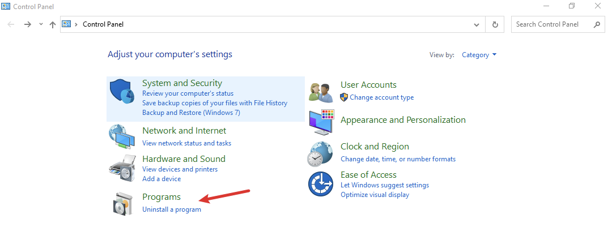
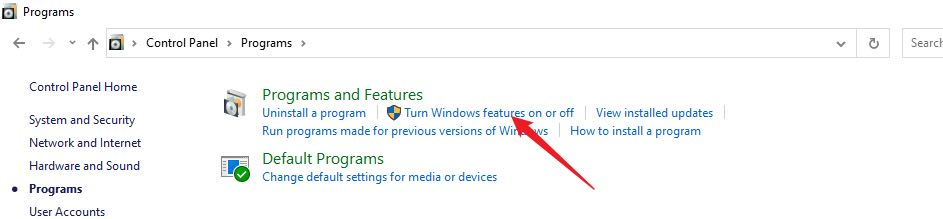

Then select the Windows Subsystem for Linux and click OK.

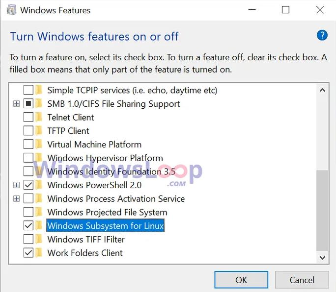

You may have some error code, generally it is due to old version of your current windows, update your windows should fix the problem. 
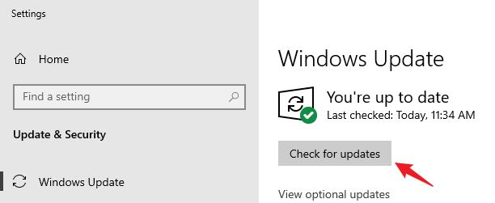

####2. 
Now you have enabled the feature, it is time to get a Linux for you. We recommend using Linux 18.04 LTS (Long term support version) as your Linux version. There are two ways to do so. You may download it from Microsoft Store, just search Linux 18.04 LTS. 

If you don’t want to install it in your C disk, you may download it from this [link] (https://drive.google.com/file/d/1yBP0fodQXuzFd9DRWxg6J7Xh2v59tvY6/view?usp=sharing)

For people who want download it to the place you want (which means you may install this on a flash drive or a portable hard drive), once you have the zip file, unzip it to a folder and you will see:

Then click the ubuntu1804.exe or open it from Microsoft Store or Quick Start Menu if you downloaded it from there. A terminal will pop up and Linux will start its initial set up, it will take a few minutes. Then it will ask you to set a username and password as its administrator
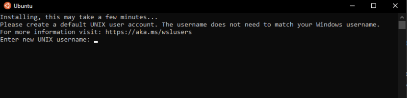

Please set your username with a lowercase alphabet start and no space between each word. 

Now, we need to make sure that the WSL you just installed is version 2, this is a preparation work for later Vivado installation. Open the Windows Powershell, type in 
```
wsl -l -v
```
, then you can check what version your wsl is.
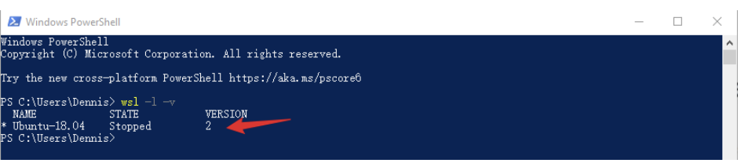

If it is not version 2, here is what you need to do.

a. [Visit here] (https://aka.ms/wsl2), under install tag, go to Manual install steps for older version, you can find a download link called WSL2 Linux kernel update package for x64 machines, download it and install.

b. In windows powershell, type in 
```
wsl --set-version Ubuntu-18.04 2
```
, this command will upgrade your wsl into version 2, it might take few minutes, wait till the terminal says conversion complete.

c. In windows powershell, type in 
```
wsl –set-default-version 2
```
, this command will set the default version into 2 in case you want to install more wsl.

Now back to the Linux terminal and type in:

```
sudo apt update 
sudo apt upgrade
```
This is for upgrading your Linux. (sudo means super user do, Linux will ask your password to processed the process, and when you type in your password, it will not appear on the terminal, don’t worry, it is designed to do so, just type in your password and press ENTER) After this step, your Linux OS is all set.

## Step 2: Steup Miniconda and hls4ml into your Linux system

As an engineer, you may be doing multiple projects at the same time, each project will use different environment and packages as its requirement. How to keep one’s environment and packages just to its own? It is time to introduce “Conda”, a powerful package manager and virtual environment builder.

In your windows browser, access [Conda.io] (https://docs.conda.io/en/latest/miniconda.html#installing)

Under Linux installers, 
right click Python3.9 version and copy the link address

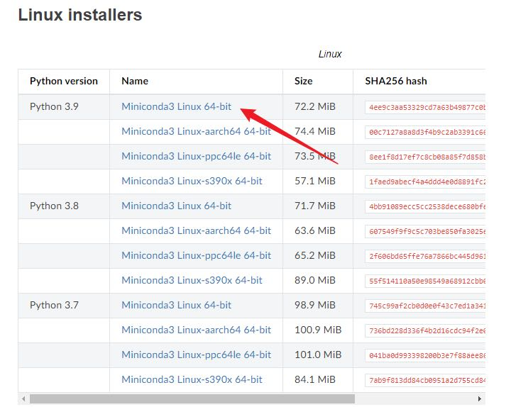
Then in your Linux terminal, type wget, then paste the link to terminal (In terminal, right click is paste), so the entire command should looks like:

```
wget https://repo.anaconda.com/miniconda/Miniconda3-py39_4.11.0-Linux-x86_64.sh
```

This command will help you download Miniconda3 installation program to your Linux. Once it is finished downloading, type the following code:

```
bash Miniconda3-py39_4.11.0-Linux-x86_64.sh
```

Or you can just type
```
bash Mini
```
then press Tab, it will auto fill the rest of the command. Then follow the guidance and finish installation. Once you finished installation, terminal will ask to whether to initialize conda or not, type yes and press ENTER.

Now we need to edit one file to make sure your Linux recognizes the conda you just installed. You will use VIM, a powerful text editor, to edit bash_profile.

Here are some commands you need to know for later operation:

```
vim <Filename>   ---to open the file we want
:wq              ---save edited file
:q!              ---quit the file without saving
i                ---change the current mode into insert mode
```

Once you enter the vim, you need to press ESC before entering the command

Please follow the steps to make the modification for your terminal:

- Type
 
```
vim ~/.bash_profile
```

- Press ENTER.
 
- Press i to change the vim into insert mode.
- Copy and paste the following things into the terminal. Change the '<YOUR USERNAME >` part into your username that you set in the step 1.

```
if [ -f ~/.bashrc ]; then . ~/.bashrc; fi

export PATH="/home/<YOUR USERNAME>/miniconda3/bin:$PATH"

alias jupyter-notebook="/home/<YOUR USERNAME>/miniconda3/envs/hls4ml-tutorial/bin/jupyter-notebook --no-browser"
```

- Press ESC and type 
```
:wq
```

- Once you exit vim, run the following code in your terminal:

```
 source ~/.bash_profile
 source ~/.bashrc
```

After making the configuration, run `conda config --set auto_activate_base false` to make sure that conda won’t activate base environment every time you turn on the terminal.


Now it is time to download hls4ml into your Linux,
run the following command:
```
git clone https://github.com/fastmachinelearning/hls4ml-tutorial.git
```

When it is finished, you need to change directory into the folder you just downloaded, here are some commands for Linux to check folders you have and change directory:

```
ls              ----list files in the current directory
cd              ----change directory

```

- To back to the home directory, run 
```
cd
```

- To change the directory into the folder you just downloaded, run
```
cd hls4ml-tutorial
```

- To let conda create the virtual environment for this project, run 
```
conda env create -f environment.yml
```

- To activate the environment after it is created, run
```
conda activate hls4ml-tutorial
```

- If you activate the environment correctly, you should see (hls4ml-tutorial) at the left of your terminal user command line: 

Now you have activated the environment, you may use
```
conda deactivate
``` 
to exit the environment, and use
```
conda env list
```
to check how many environments you have on this Linux. Remember to activate your environment every time you want to do this project on your local machine. 

## Step 3: Download Jupyter Notebook (Not necessary but highly recommanded)

We now want to use Jupyter-notebook (A web-based interactive computing platform) to run all the stuffs we need. Normally, we need to have a browser to do so, but WSL doesn’t have graphic interface, so we will use windows’ browser to assist us. Remember the last line that we put in your bash_profile? 
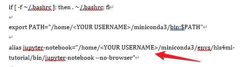

This line creates an alias that whenever you run jupyter-notebook, it will run it without showing browser, instead it will give us a token that can be access though any browser which is sharing the same local area network. Here is an example:
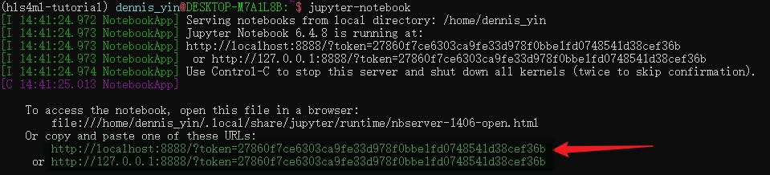
Copy one of these URL into the browser, and you may access your directory in your browser. 

If everything goes smoothly, you should look something like this:
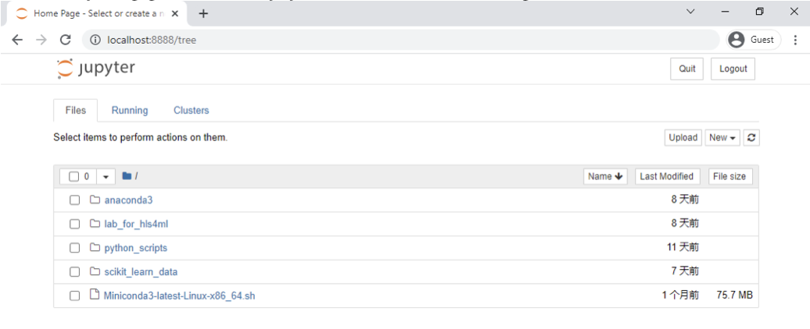
This is my linux home directory, yours definitely going to looks different. In your directory, find the folder _hls4ml-tutorial_, and inside, you should be able to see these:

Click _part1\_getting\_started.ipynb_ and run the Part 1 code, you may have some error saying not able to access dynamic library, it just means it cannot detect your GPU and it will continue process with your CPU.
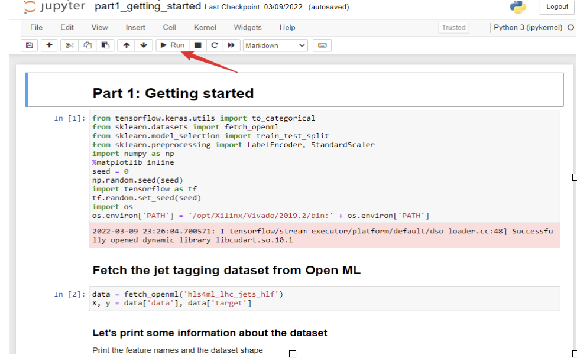

You probably are going to encounter some errors when running these codes, one common error is that it cannot find Keras or cannot Import TensorFlow properly, in that case, you need to reinstall TensorFlow. Close Jupyter notebook and go back to linux terminal. In the terminal, press
```
ctrl 
```
+
```
c
```
 will interrupt the program, the notebook will ask you do you want to exit, type 
```
y
```
and press 
```
Enter
```
.

Then under your hls4ml-tutorial environment, use 
```
pip uninstall tensorflow
```
, wait till the process finished, then type 
```
pip install tensorflow
```

If you encounter other problems, please contact me at lostecho@uw.edu or on Slack. Let’s solve it together.


## Step 4: Download Vivado

Now you should be able to run all steps in tutorial 1 besides the last, the last step requires a C to Verilog complier—Vivado_hls. To install this, we will need a graphic interface to install Vivado, so please follow the following steps carefully.

In the Linux terminal, run the following commands in order:
```
sudo apt-get purge xrdp
```
```
sudo apt install -y xrdp
```
```
sudo apt install -y xfce4
```
```
sudo apt install -y xfce4-goodies
```

What we did above is to install a server deployer and a graphic user interface to our WSL, so later we can use Windows remote desktop connection feature to connect our WSL to have a graphic interface.

```
sudo cp /etc/xrdp/xrdp.ini /etc/xrdp/xrdp.ini.bak

sudo sed -i ‘s/3389/3390/g’ /etc/xrdp/xrdp.ini

sudo sed -i ‘s/max_bpp=32/#max_bpp=32\nmax_bpp=128/g’ /etc/xrdp/xrdp.ini

sudo sed -i ‘s/xserverbpp=24/#xserverbpp=24\nxserverbpp=128/g’ /etc/xrdp/xrdp.ini
echo xfce4-session > ~/.xsession
```

What we did here is doing some adjustment on the user interface and make sure that this server can enable our user interface properly. So we first make a backup of the _xrdp.ini_ file in case we messed up. Then we change the connection port from 3389 to 3390, you can change whatever port you want, but recommend at least over 3300 and lower than 31000. Then we change the resolution for the interface to make it not blur, at the end we add _xfce4-session_ in to the _.xsession_ file to make it recognize the interface.

Now we need to make sure that every time we launch the server, it will use the user interface instead of default UI. We need to modify the _startwm.sh_ file using VIM by the following command:
```
sudo vim /etc/xrdp/startwm.sh
```

Once inside the file, we need to comment out these two lines by adding # signal in front 
From:

```
test -x /etc/X11/Xsession && exec /etc/X11Xsession

exec /bin/sh /etc/X11/Xsession
```
To:

```
# test -x /etc/X11/Xsession && exec /etc/X11/Xsession

# exec /bin/sh /etc/X11/Xsession
```

Then we need to add this two line at the end of this file:

```
# xfce

startxfce4
```

Now you have finished modify the configuration for your local Linux server.
	To start the server, type 
```
sudo /etc/init.d/xrdp start
```
	
to end the server, type :
```
sudo /etc/init.d/xrdp stop
```

Once you started the server, go to remote desktop connection on your windows, you can search it the same way you did in the first step, in search bar.
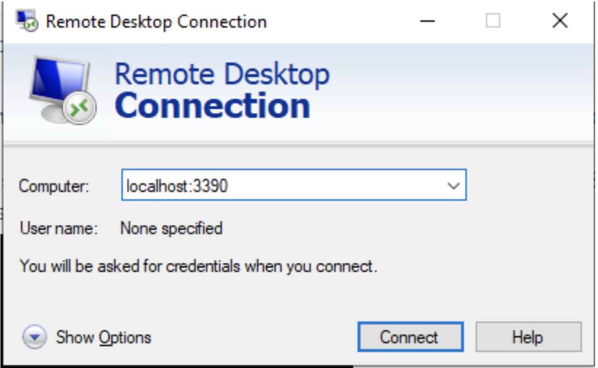

In the Computer line, type localhost:3390, and then connect.

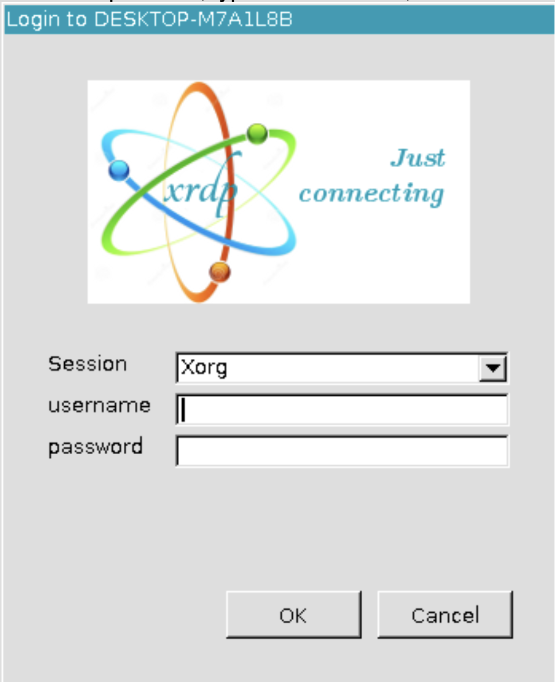

Use the same username and password you created in the pervious part to login.

When you get inside the server, right click can callout a menu which you can get a terminal from there. In the terminal, type in `sudo apt install firefox` to get a web browser for you.

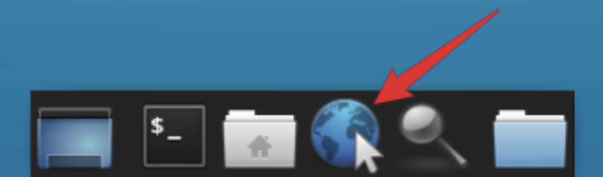

Once installed, you can access it from the bottom menu.
Now you have your own GUI for operation linux, but this GUI is mainly for install vivado. So moving on.

Download vivado from [google drive] (https://drive.google.com/file/d/1WO01bS3iN9yfolHHp8Ei3jNzKc60Y-Zb/view)
or from the [official website] (https://www.xilinx.com/support/download.html)

we recommend to download from our drive because the tutorial uses the same version as we provided. But if you decided to download from the website, it has to be 2019.1 or 2019.2 version.

Once downloaded, you can access the file from Download folder. To run the file, you need to do the following since it is a bin file.


Type
```
chmod +777 ./X
```
then press Tab, it will auto fill the rest file name for you.
This command will help change the file into readable writeable and executable file.


Then type `./X` then press Tab and Enter to start the install program.

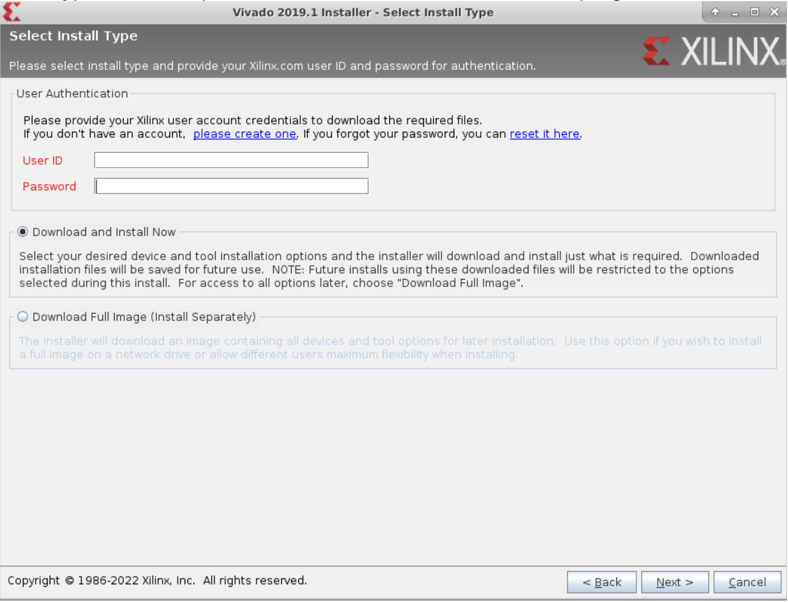

You need to create an account at the first step of installation. Just click the create one and follow the procedure to create a student account. 
After getting your account, put it in and continue the installation.

Follow the procedure and you will see a Select Edition to install panel, choose Vivado HL Design Edition and continue. 
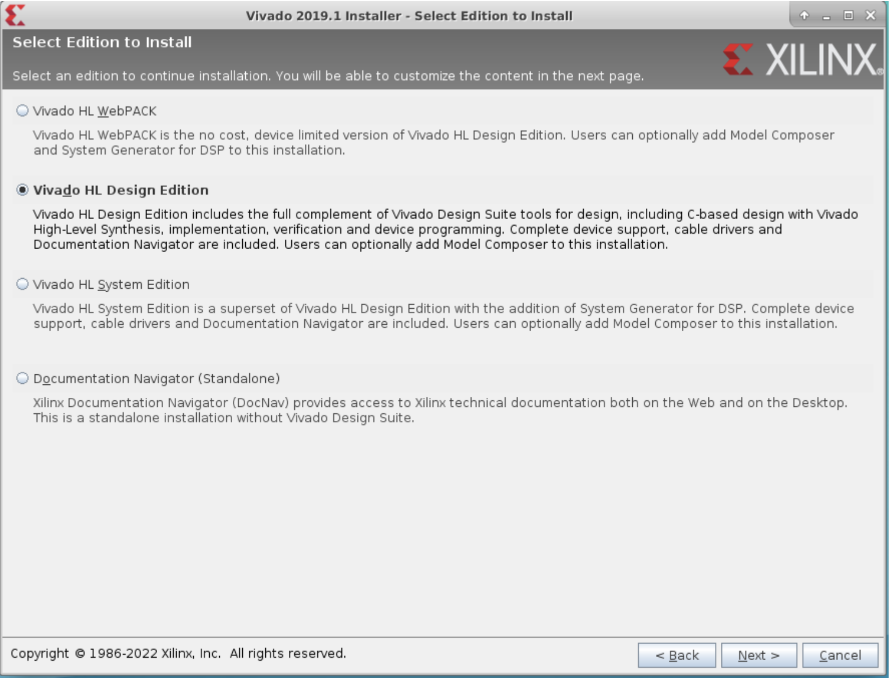

Vivado takes at least 68 GB to install.

When you finally finished installing, you will need to do similar process that you did in conda step to make sure Linux recognize the Vivado you installed.

a) Type 
```
vim ~/.bash_profile
```
and press ENTER.

b) Press `i` to change the vim into insert mode.

c) Copy and paste the following things into the end of the file. Change the `<YOUR USERNAME>` part into your username that you set in the step 1.
```
export PATH="/tools/Xilinx/Vivado/2019.1/bin:$PATH"
```

d) Press ESC and type 
```
:wq
```

e) Type 
```
vim ~/.bashrc
```
and press ENTER.

f) Press `i` to change the vim into insert mode.

g) Copy and paste the following things into the end of the file. Change the `<YOUR USERNAME>` part into your username that you set in the step 1.

```
export PATH="/home/<YOUR USERNAME>/miniconda3/bin:$PATH"

alias jupyter-notebook="/home/<YOUR USERNAME>/miniconda3/envs/hls4ml-tutorial/bin/jupyter-notebook --no-browser"

export PATH="/tools/Xilinx/Vivado/2019.1/bin:$PATH"
```
	
h) Press ESC and type 
```
:wq
```

i) Once you exit vim, run 
```
source ~/.bash_profile
```
and 
```
source ~/.bashrc
```
in your terminal

Now you are all set to run the hls4ml-tutorial on your local machine. Please follow the hls4ml training and explaining part carefully, you will learn how to train a model and then convert it into FPGA bit stream. Here are some resources that could help you better understand the hls4ml.

[Linux Tutorial for Beginners: Introduction to Linux Operating System] (https://www.youtube.com/watch?v=V1y-mbWM3B8)

[HLS4ML Tutorial] (https://github.com/fastmachinelearning/hls4ml-tutorial)

[HLS4ML Guide] (https://fastmachinelearning.org/hls4ml/)


